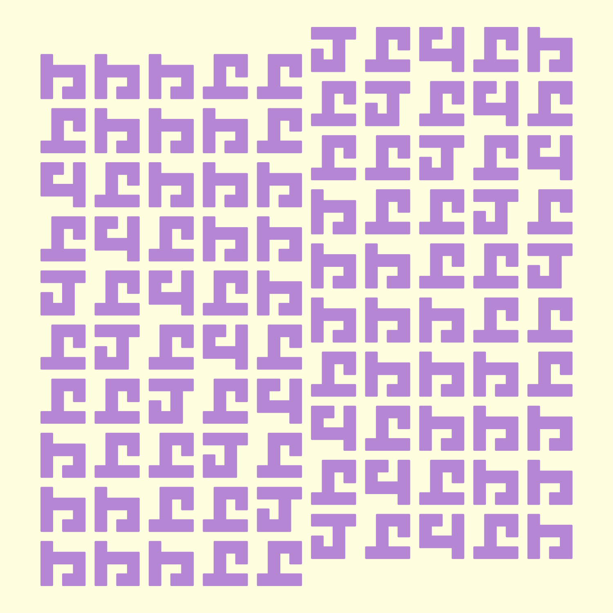

# Workshops

## Purpose

This repo is for the exercises for online R/Quarto workshops. Those
workshops include:

Doing / Done:

- [Big Data in R with Arrow](https://posit-conf-2023.github.io/arrow/)
- [Steal like an Rtist: Creative Coding in
  R](https://github.com/posit-conf-2023/creative-coding)

To do:

- [DevOps for Data
  Scientist](https://github.com/posit-conf-2023/devops/)
- [What They Forgot to Teach You About
  R](https://github.com/posit-conf-2023/wtf/)
- [Designing Data Visualizations to Successfully Tell a
  Story](https://posit-conf-2023.github.io/dataviz-storytelling/)
- [Engaging and Beautiful Data Visualizations with
  ggplot2](https://posit-conf-2023.github.io/dataviz-ggplot2/)
- [From R User to R
  Programmer](https://posit-conf-2023.github.io/programming-r/)
- [Fundamentals of Package
  Development](https://posit-conf-2023.github.io/pkg-dev/)
- [Package Development
  Masterclass](https://github.com/posit-conf-2023/pkg-dev-masterclass)

The listing for RStudio/Posit conferences are below:

- [posit::conf(2023)](https://posit.co/blog/talks-and-workshops-from-posit-conf-2023/)
- [rstudio::conf(2022)](https://posit.co/blog/talks-and-workshops-from-rstudio-conf-2022/)

## Content

    .
    ├── arrow-workshop
    ├── devops
    ├── r-programmer
    ├── steal-like-artist
    │   ├── code
    │   ├── exercises
    │   │   ├── 02-homage-to-the-square
    │   │   ├── 03-ot
    │   │   │   ├── letters
    │   │   │   └── letters_solutions
    │   │   ├── 04-riso-grids
    │   │   └── 05-infinite-truchet
    │   │       └── truchet_tiles_examples
    │   └── images
    └── what-they-forgot

## Notes

The large amount of data used in the Arrow workshop has been moved to
`C:\Users\jmdud\Documents (local)\data` (so it won’t be synced with
OneDrive), and put in the `.gitignore`.

## Steal like an artist

